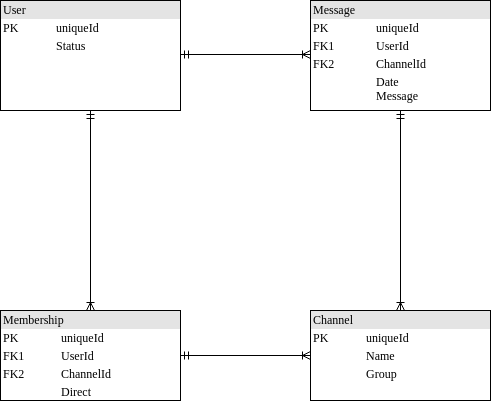

export { default as theme } from "@mdx-deck/themes";
import Layout from "./components/main.page";
import { Invert } from "mdx-deck/layouts";

<Layout>

# Slack clone project

</Layout>

---

# Format

- 1h - 1h:30min videos
- multiple episodes long projects
- modern technologies, tools and SaaS services
- :sunglasses:

---

import Technologies from "./components/technologies.page";

<Technologies />

---

import Architecture from "./components/architecture.page";

<Architecture />

---

# Functional requirements

- realtime chat
- search users
- direct and group chat
- full text search for messages

---

## Database schema

